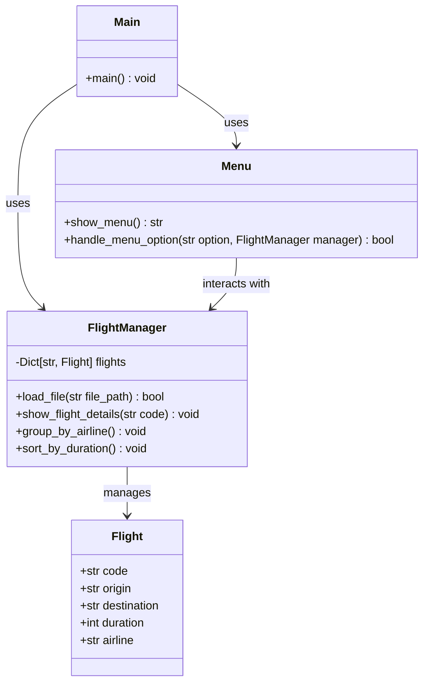

# IPC2_T1_VJ_202003654
TAREA #1 IPC FERNANDO MORALES 20203654

## Diagrama de Clases

## Descripción de las Clases

### Flight
- Clase de datos que representa un vuelo
- Atributos: código, origen, destino, duración y aerolínea
- Utiliza @dataclass para generación automática de métodos

### FlightManager
- Gestiona todas las operaciones relacionadas con vuelos
- Mantiene un diccionario de vuelos
- Implementa operaciones de carga, consulta, agrupación y ordenamiento

### Menu
- Maneja la interfaz de usuario
- Proporciona opciones de menú
- Procesa las selecciones del usuario

### Main
- Punto de entrada del programa
- Inicializa y coordina los componentes principales
